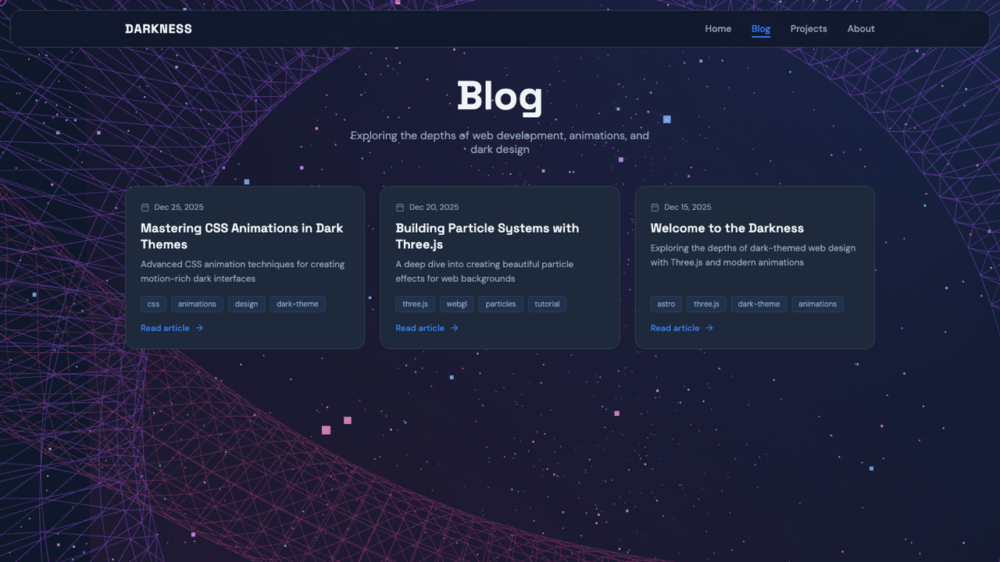
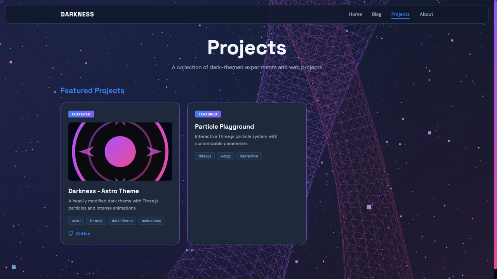

# 🌌 Darkness — Modern Dark Portfolio & Blog Theme

<p align="center">
  <strong>基于 Astro 6 与 Three.js 构建的暗黑风沉浸式作品集 & 博客主题</strong>
</p>

<p align="center">
  搭载 GPU 加速的 5,000 动态交互粒子星空背景，兼具极致性能体验与现代极客审美。
</p>


---


- ⚡️ **GPU 驱动的三维粒子背景**：基于 Three.js 打造，随页面动态交互，平滑高效。
- 📝 **现代化博客系统**：内置 Astro Content Collections + MDX 支持，语法高亮与结构化元数据。
- 💼 **作品集 showcase**：支持精选项目高亮置顶、分类标签与外部链接整合。
- 📱 **全端自适应响应式**：移动端优先的设计语言，搭配悬浮式悬浮导航栏。
- 🎨 **一键视觉主题化**：通过集中化的 CSS 变量配置，瞬间焕新整个网站色彩系统。
- 🚀 **Astro 6 极致性能**：默认零 JS 运行时开销，开箱即用的 SEO & Sitemap 优化。
- 🛡️ **全程 TypeScript 类型安全**：从组件到 Markdown 文章前言均提供严苛的类型检查。

---

## 📸 界面预览

| 博客列表 (Blog) | 项目展示 (Projects) |
| :---: | :---: |
|  |  |
| **关于页面 (About)** | **移动端效果 (Mobile)** |
|  |  |

---

## 🛠️ 快速开始

> 💡 **运行环境要求**：Node.js **v22.0.0+** (以完全支持 Astro 6)。

```bash
# 1. 克隆项目仓库
git clone https://github.com/kpab/astro-darkness.git
cd astro-darkness

# 2. 安装依赖包
npm install

# 3. 启动开发服务器
npm run dev

# 4. 构建生产环境包
npm run build
```

---

## ✍️ 内容发布指南

### 📰 撰写博客文章

在 `src/content/blog/` 目录下创建 Markdown 或 MDX 文件：

```markdown
---
title: '深入理解 WebGL 与 Three.js 粒子系统'
description: '探索如何在 Web 前端构建高性能 3D 交互特效'
pubDate: 2026-07-19
tags: ['astro', 'three.js', 'webgl']
---

在此处撰写您的博客正文内容...
```

### 🛠️ 添加项目作品

在 `src/content/projects/` 目录下创建 Markdown 文件：

```markdown
---
title: 'Astro Darkness 主题模板'
description: '基于 Astro 6 与 Three.js 构建的暗黑风格全栈博客'
github: 'https://github.com/kpab/astro-darkness'
tags: ['astro', 'typescript', 'three.js']
featured: true
---
```

---

## 🎨 个性化定制

所有全局样式与设计标记 (Design Tokens) 统一存放在 `src/styles/global.css` 中，您可以随时修改调整：

```css
:root {
  /* 基础配色 */
  --color-bg-dark: #0F172A;
  --color-primary: #3B82F6;
  --color-accent-purple: #8B5CF6;
  
  /* 字体排版 */
  --font-heading: 'Space Grotesk', sans-serif;
  --font-body: 'DM Sans', sans-serif;
}
```

---

## 📂 项目结构概览

```text
src/
├── components/    # 封装的可复用 UI 组件 (Header, Footer, Card 等)
├── content/       # 博客文章与项目 showcase 内容库 (Markdown/MDX)
├── layouts/       # 页面整体通用布局
├── pages/         # Astro 路由页面 (首页, 博客, 项目, 关于)
└── styles/        # 全局 CSS 样式与设计标记变量
```

---

## 🛠️ 技术选型栈

- [Astro](https://astro.build/) — 现代化的静态站点生成器
- [Three.js](https://threejs.org/) — 强大的 Web 3D 渲染引擎
- [TypeScript](https://www.typescriptlang.org/) — 严格的类型安全保障
- [Google Fonts](https://fonts.google.com/) — 精选 Space Grotesk 与 DM Sans 现代字体

---

## 📄 开源许可证

本项目采用 [MIT License](LICENSE) 许可协议。

---
